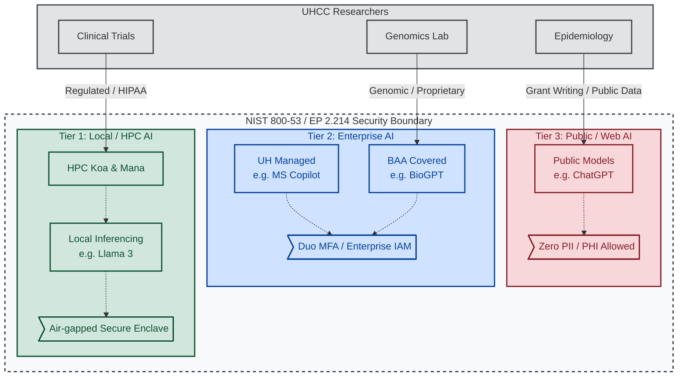
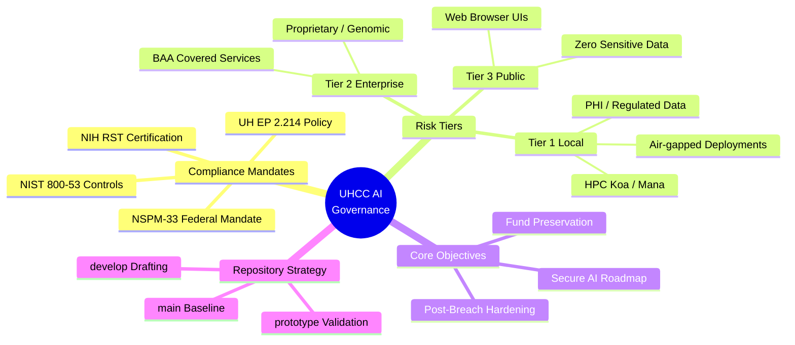

# 🛡️ UHCC AI Research Security & Governance Framework (2026)
## Project Baseline: BSR-AI-UHCC

  

## 🏛️ System Architecture & Data Flow

## 🧠 Governance Framework Mind Map

## Overview
This repository serves as the **Master Governance Framework** for the University of Hawaii Cancer Center (UHCC). It establishes the formal security baseline bridging **UH Executive Policy 2.214** and **Federal Research Security Mandates** (NSPM-33, NIH, and NIST 800-53). 

This framework provides the authoritative documentation, technical controls, and inventory tracking mechanisms requisite for secure, compliant Artificial Intelligence (AI) implementation across UHCC research operations.

### Core Objectives
1. **Fund Preservation:** Ensure 100% compliance with May 2026 NIH Research Security Training (RST) mandates to protect grant eligibility.
2. **Post-Breach Hardening:** Implement rigorous technical controls and remediation strategies identified during the 2025 ransomware recovery.
3. **AI Governance:** Establish a secure, scalable roadmap empowering 400+ researchers to leverage advanced AI models without compromising PHI, PII, or proprietary genomic data.

---

## Scope

### In Scope
- Approved enterprise policies and baseline security controls governing AI usage.
- Active drafting and maintenance of lab-specific security plans and standard operating procedures (SOPs).
- Pilot testing, validation, and deployment parameters for local AI instances (e.g., HPC Koa/Mana).
- Continuous auditing and inventory management of all AI models (Enterprise, Local, and Public Web).

### Out of Scope
- General IT infrastructure and networking components outside the direct purview of AI governance.
- Legacy software applications that do not utilize machine learning or generative AI capabilities.

---

## Repository Structure

The framework is organized into targeted branches to maintain operational integrity:

- `main`: **Production Baseline.** Contains approved, executive-signed policy and baseline security controls.
- `develop`: **Active Drafting.** Workspace for iterative lab-specific security plans and emerging governance protocols.
- `prototype`: **Technical Validation.** Pilot testing configurations for local, air-gapped AI instances (HPC Koa/Mana).

### Key Documents
- 📊 `UHCC_Security_Governance_Master.xlsx`: Multi-tab source of truth tracking NIST 800-53 compliance and the comprehensive AI Tool Correlation Inventory.
- 📑 `UHCC_Security_Governance_Documentation.md`: Formal governance framework prepared for executive signature.
- 🚨 `UHCC_30_Day_Brutal_Fix.md`: The aggressive 30-day technical enforcement roadmap and post-breach mitigation strategy.

---

## Change Management
Strict configuration and change management protocols govern this repository. All proposed modifications to the baseline architecture or governance documentation must undergo:
1. **Peer Review:** Technical validation by the core security team.
2. **Approval Workflow:** Adherence to established UHCC governance procedures, requiring sign-off from the Information System Security Manager (ISSM) or designated authority.

---

## Future Additions & Considerations
- **Pilot Expansion:** Strategic expansion of AI pilot tests to wider research groups following successful security validation.
- **Continuous Compliance:** Regular audits and automated assessments to maintain alignment with evolving NIST frameworks and updated federal guidelines.
- **Federated Learning integration:** Future-proofing the architecture to support secure, multi-institutional federated learning workloads.

---

## Limitations
This framework is currently in the **baseline phase**. Ongoing adaptation, control refinement, and policy updates will be required to maintain parity with rapidly evolving federal mandates (e.g., upcoming ARPA-H directives) and emerging AI threat vectors.

---

### 🚀 2026 Compliance Milestones
- **May 25, 2026:** Deadline for NIH Mandatory RST Certification.
- **July 2026:** Final deadline for NSPM-33 Federal Research Security Program certification.
