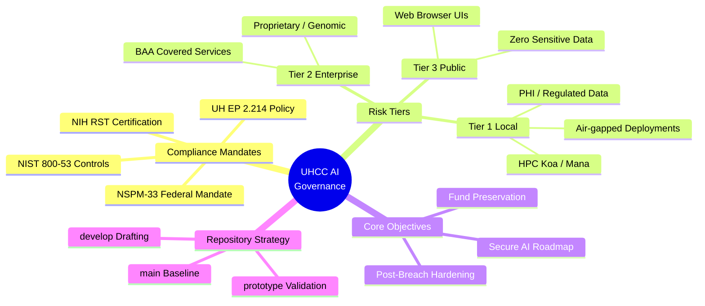
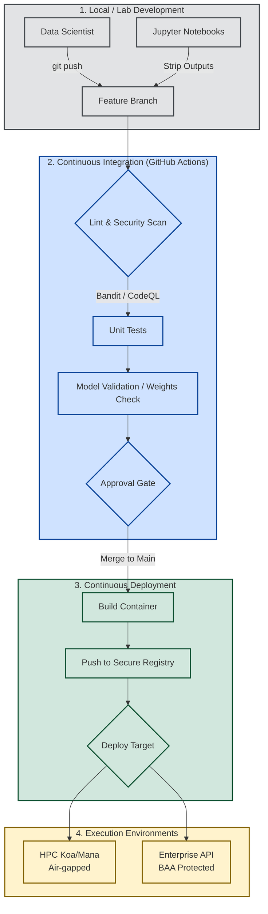
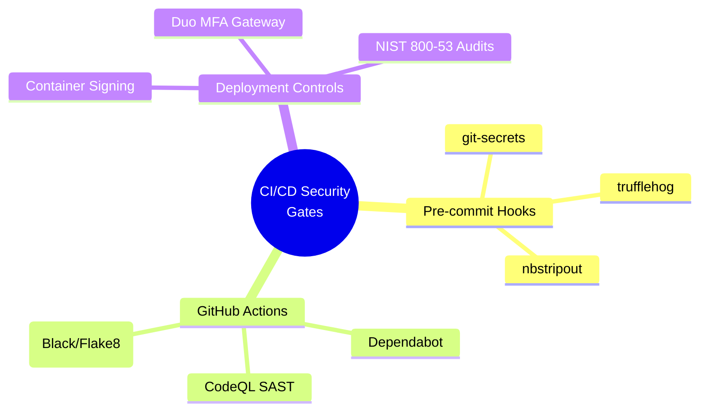

# 🚀 CICD-AI-UHCC: Enterprise ML Ops & Automation Pipeline

    

*Developed by the University of Hawaii Cancer Center (UHCC) and the Research Corporation of the University of Hawaii (RCUH).*

## 📖 Overview
**CICD-AI-UHCC** is the official open-source Continuous Integration and Continuous Deployment (CI/CD) framework designed specifically for secure Artificial Intelligence and Machine Learning workloads at UHCC. 

This repository standardizes how AI models (from predictive genomics to epidemiological NLP models) are tested, hardened, and deployed across Tier 1 (HPC Koa/Mana), Tier 2 (Enterprise), and Tier 3 (Public) environments. **This pipeline strictly enforces NIST 800-53, NCI specifications, UH EP 2.214 data governance, and NIH Research Security Training (RST) mandates to aggressively protect grant eligibility without compromising patient data integrity.**

### 📚 [Explore the Official Documentation Wiki](./docs/Home.md)
All current and future AI Agents, sessions, and ML pipelines utilizing this framework **MUST** adhere to the guidelines set forth in the [UH Executive Policy 2.214 AI Compliance Document](./docs/EP-2.214-Compliance.md).

---

## 🏛️ System Architecture & Data Flow

---

## 🧠 Governance Framework Mind Map

---

## 🏗️ Automated ML Ops Architecture

---

## 🔒 CI/CD Security Gates
This pipeline strictly enforces federal mandates (NSPM-33) and institutional policy (UH EP 2.214).

---

## 🤝 Community & Contributing
We welcome contributions from the open-source community, provided they adhere to our strict security standards. 

- **[Contributing Guidelines](CONTRIBUTING.md)**: Learn how to submit a PR and run local tests.
- **[Code of Conduct](CODE_OF_CONDUCT.md)**: Our commitment to a professional and inclusive environment.
- **[Security Policy](SECURITY.md)**: Instructions for responsibly disclosing vulnerabilities.

> **CRITICAL**: Never commit API keys, SSH keys, or Protected Health Information (PHI). All sample data must be synthetic.

---

## ⚖️ License & Disclaimer
This project is licensed under the **Apache License 2.0** - see the `LICENSE` file for details. 

*Disclaimer: This software is provided "as is" by the University of Hawaii Cancer Center and RCUH. It is intended for the advancement of open research. The institutions assume no liability for the misconfiguration of CI/CD pipelines utilizing this code.*
