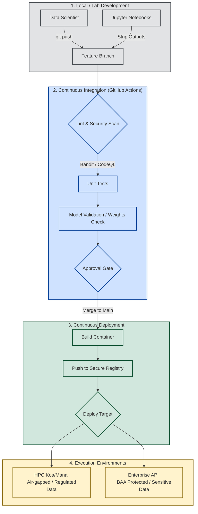

# 🏗️ Automated ML Ops Architecture

The CICD-AI-UHCC pipeline bridges the gap between raw data science and secure, compliant production.

## The Deployment Lifecycle

## Core Security Gates
1. **Pre-commit Hooks:** All researchers must use `nbstripout` to clear Jupyter notebook outputs before committing to ensure PHI/PII does not leak into git history.
2. **SAST Scanning:** We utilize `CodeQL` and `Dependabot` on every pull request.
3. **Approval Gates:** Pushing to the `main` baseline requires review from the core InfoSec team.

*All deployments must follow the [EP 2.214 Compliance](./EP-2.214-Compliance.md) mandates.*
